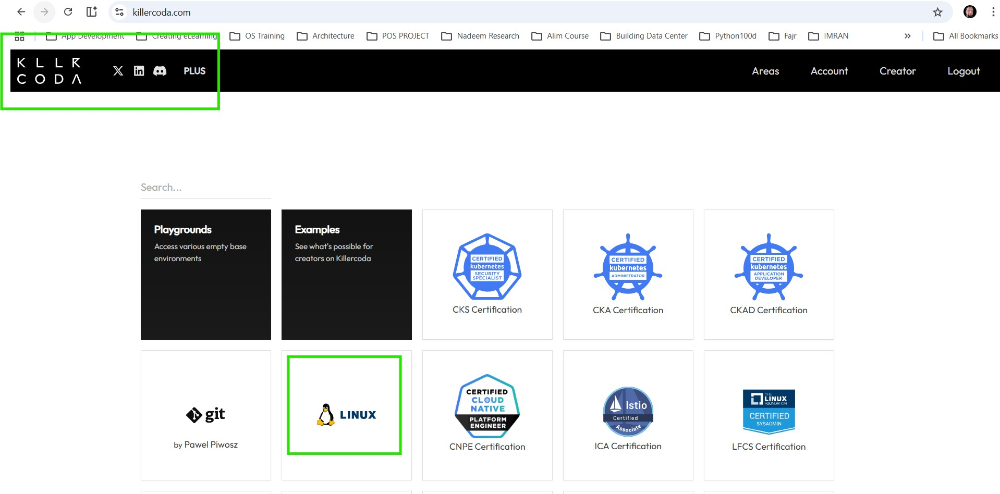
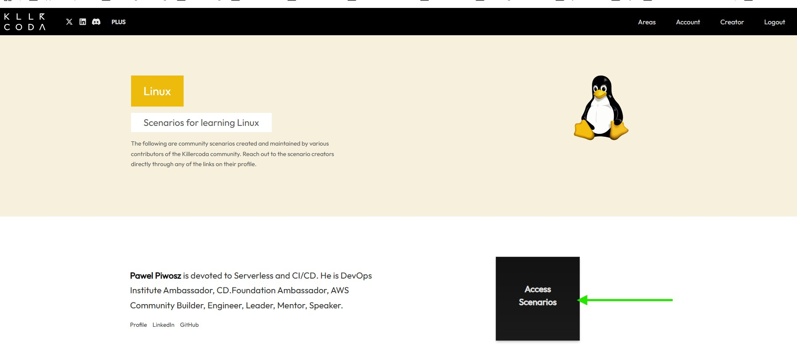
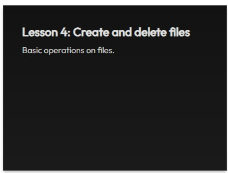

# Practice Lab - Day 12
> 20th May, 2026

Yeh Practice Lab aapko hands-on understanding dene ke liye design ki gayi hai using 
```
https://killercoda.com
```

---

# Table of Contents
g
| Task | Title |
|------|--------|
| 1 | [Landing Page aur Linux Module Select Karna](#task-1-click-on-the-landing-page-and-select-the-linux-module) |
| 2 | [Linux Module Select Karna](#task-2-select-the-linux-module) |
| 3 | [Tamam 4 Lessons Complete Karna](#note-there-are-a-total-of-four-4-lessons-that-you-must-complete-in-killercoda) |
| 4 | [Lesson 1 - List Files](#task-4-lesson1---list-files) |
| 5 | [Lesson 2 - Aapka Best Friend "man"](#task-2-lesson-2---your-best-friend-man) |
| 6 | [Lesson 3 - Files Create aur Delete Karna](#task-3-lesson-3---create-and-delete-files) |
| 7 | [Lesson 4 - Files Create aur Delete Karna](#task-4-lesson-4---create-and-delete-files) |
| 8 | [Final Submission](#final-submission) |

---

### Task 1: Landing Page par Click Karein aur Linux Module Select Karein
https://killercoda.com 



---

### Task 2: "Linux" Module Select Karein

Neeche diya gaya module select karein:

> Pawel Piwosz Serverless aur CI/CD ke field mein devoted hain. Woh DevOps Institute Ambassador, CD.Foundation Ambassador, AWS Community Builder, Engineer, Leader, Mentor aur Speaker hain.



---

# NOTE: Killercoda mein Total 4 Lessons Complete Karne Hain


---

### Task 4: Lesson1 - List Files

Neeche diya gaya module select karein:


---

### Aapko Neeche Wali Screen Nazar Aayegi

Provided Linux Box use karein aur tamam steps follow karein.


---

Jab aap complete kar lein to blue button "NEXT" par click karein:


---

### IMPORTANT NOTE

EXIT mat karein.

Agar aap baad mein dobara start karna chahte hain to "NEXT" press karte rahen jab tak final screen na aa jaye aur phir "Scenario" par click karein.


---

Aapko "Exit" ka option diya jayega to uspe click karein.

Agar aap dobara shuru karna chahte hain to phir se kar sakte hain.

Agar aap complete kar chuke hain to Congratulations!


---

# Neeche Diye Gaye Tamam Modules bhi Complete Karein

---

### Task 2: Lesson 2 - Aapka Best Friend "man"


---

### Task 3: Lesson 3 - Directories kay saat kaam karain


---

### Task 4: Lesson 4 - Files Create aur Delete Karna



---

# Final Submission

Apne LinkedIn account par Working in Nexus (NIT) mein apna 12th Day post karein.

Neeche diye gaye questions ka jawab dein:

- Kya aapko Linux Commands ke saath kaam karna pasand aaya?
- Aapne kaunsi Linux commands practice ki?
- Kaunsa lesson sabse zyada interesting laga?
- Aapne Killercoda se kya seekha?

---

Source Material: :contentReference[oaicite:0]{index=0}